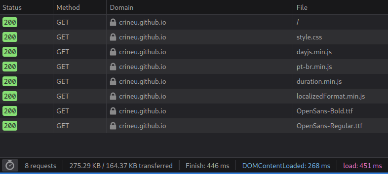
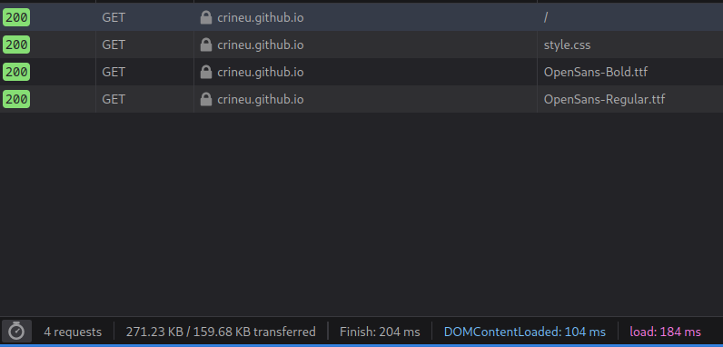
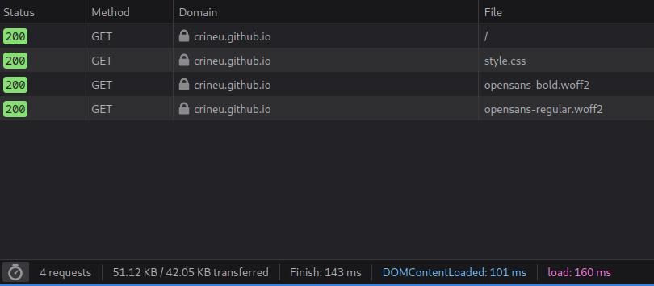

# Idades de crianças

> html estático mostrando a diferença de idade entre meus piá

## Subindo servidor local para testes com requisições

* Python 3.x:  `python -m http.server 8000`
* Python 2.x:  `python -m SimpleHTTPServer 8000`
* Ruby 1.9.2+: `ruby -run -ehttpd . -p8000`
* Node.js:     `npx superstatic -p 8000`
* PHP (>=5.4): `php -S 0:8000`

## Otimizações para as requisições

Tempo de carregamento dessa simples página era muito grande com referências externas. Primeiro ação foi trazer todos assets para dentro do projeto / servidor (javascript e arquivos de fontes):

Isso gerou 8 requisições pra essa modesta página, acima do limite. Os arquivos .js foram adicionados de forma inline diretamente ao `index.html`:

 

Baixar para 4 requisições é bom demais, mas as fontes .ttf ainda eram arquivos grandes demais. Após otimizadas em https://www.fontsquirrel.com, temos um site com ~50kb carregado em ~200ms - aceitável:

 
